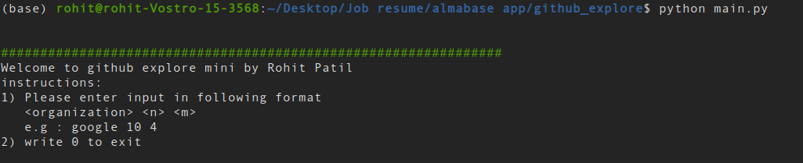
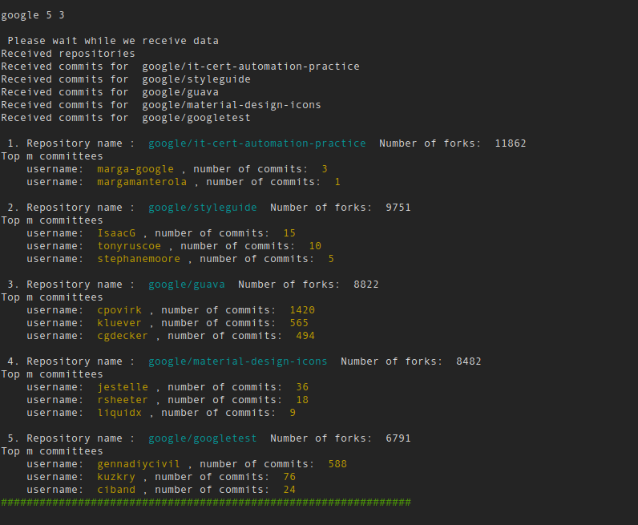

# mini_github_explore

This program provides a minimal set of services to explore github repositories.


### Input
  Program takes input in following format:
     <organization> <n> <m>
     e.g : google 10 4

  Here, first input is the organization on github, e.g. Google, microsoft etc.<br>
    Second input(n) is the number of most popular repositories based on total forks.<br>
    Third input(m) is the number of top committes.<br>
  To exit the program write 0 and press enter.<br>
### Output
  The program prints n popular repositories( only if n are available in the first place) with respective fork count.<br>
  Then for each repository it prints the username of top m committees with their commit count.<br>
  
### how to run.

#### Required Libraries: requests | sys | json | termcolor

download main.py script <br>
This script uses github API. <br>
Generate a access token on your github with containing feature of access to public repositories. <br>
Write your access token in line 9. <br>
```
TOKEN = "<your token here>"

```

Run main.py to use the program.

## Screenshots


